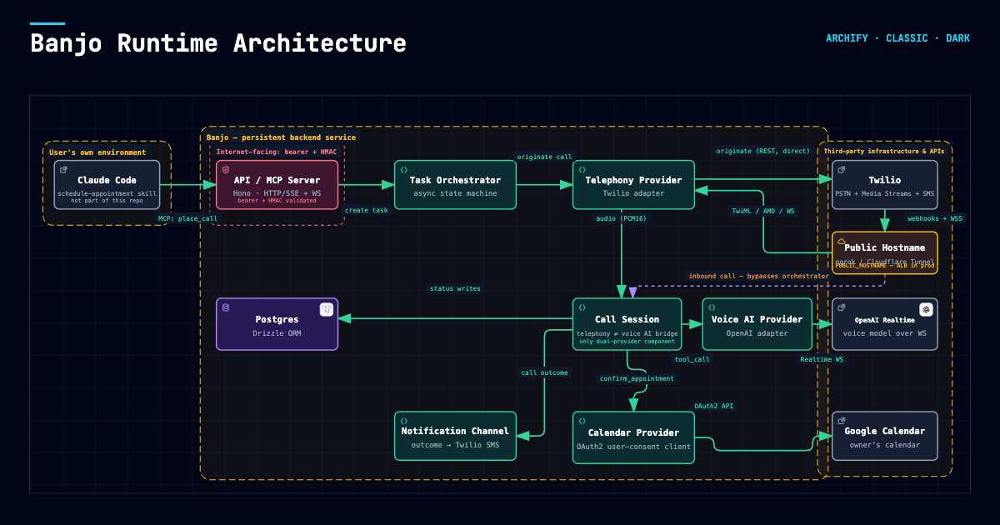

# Banjo

An open-source AI executive assistant that places real outbound phone calls on your behalf — books
appointments, makes reservations, delivers messages — using a vendor-agnostic real-time Voice AI (OpenAI
Realtime, Gemini Live, or ElevenLabs Conversational AI) over Twilio. It can also answer inbound calls to your
own number for people who want to book, check, or reschedule an appointment with you directly.

**Why this exists:** closed SaaS "AI assistant that calls people for you" products exist — this is the
version you can actually read, run yourself, and change. Single-tenant by design: you run your own instance
against your own Twilio number, your own calendar, your own voice AI credentials. Fork it and make it yours.

See [`docs/ARCHITECTURE.md`](docs/ARCHITECTURE.md) for the full design, [`docs/RUNBOOKS.md`](docs/RUNBOOKS.md)
for operational procedures, and [`docs/COMPETITIVE_LANDSCAPE.md`](docs/COMPETITIVE_LANDSCAPE.md) for how Banjo
compares to other open-source projects in this space and the roadmap for its voice/telephony abstraction.

[](docs/ARCHITECTURE.md)

## Quickstart

Banjo needs three things before it can place a real call — get these first:

1. **A Twilio account and phone number.** Sign up at [twilio.com](https://www.twilio.com), buy a phone
   number capable of voice calls, and note your Account SID, Auth Token, and the number itself.
2. **A voice AI provider.** OpenAI Realtime is the most battle-tested option here and the recommended
   default — Gemini Live and ElevenLabs Conversational AI are supported but flagged
   `NEEDS VERIFICATION` in a few places (see `docs/ARCHITECTURE.md`'s Open Risks section) since they haven't
   carried live call traffic the way the OpenAI path has. Get an API key from whichever you pick.
3. **A Google Calendar OAuth client + refresh token**, if you want live calendar-aware booking (see
   `docs/ARCHITECTURE.md`'s Calendar section for how this is wired).
4. **A publicly reachable hostname for your local server.** Twilio calls back into Banjo over plain HTTPS
   (webhooks) and a WebSocket (the audio Media Stream), so it needs a real internet-facing hostname even in
   local dev — `localhost` won't work. The quickest way:

   ```bash
   ngrok http 3000   # or whatever PORT you set
   ```

   Take the hostname ngrok prints (e.g. `abcd1234.ngrok-free.app`, no `https://` prefix) and set it as
   `PUBLIC_HOSTNAME` in `.env`. Other options, roughly in order of effort:

   | Option | When to use it |
   | --- | --- |
   | [ngrok](https://ngrok.com) | Local dev, quickest to set up. Free tier URLs rotate on every restart — update `PUBLIC_HOSTNAME` each time, or use a paid static domain. |
   | [Cloudflare Tunnel](https://developers.cloudflare.com/cloudflare-one/connections/connect-networks/) (`cloudflared`) | Local dev with a stable hostname you control, free, tied to a domain you own in Cloudflare. |
   | Reverse-proxy through a real deployment (e.g. an ALB, as the `.env.example` default hints) | Once Banjo is running as a persistent service rather than on your laptop — see `docs/RUNBOOKS.md`. |

Then:

```bash
cp .env.example .env   # fill in ASSISTANT_PRINCIPAL_NAME + everything from steps 1-3 above
npm install
docker compose up -d   # local Postgres
npm run db:generate && npm run db:migrate
npm run dev
```

## Companion Claude Code skill

Banjo only handles the phone-calling half of "get this errand done." The other half — deciding
whether to book online or by phone, and driving the online booking flow via browser automation —
is a Claude Code skill that ships alongside this repo at [`skills/schedule-appointment/`](skills/schedule-appointment/SKILL.md).
Install it by symlinking (not copying) into your Claude Code skills directory, so future edits to
the skill stay live without a separate sync step:

```bash
ln -s "$(pwd)/skills/schedule-appointment" ~/.claude/skills/schedule-appointment
```

The skill reads `$ASSISTANT_PRINCIPAL_NAME` for how to address you, matching the same env var
Banjo's backend uses — set it once in your shell/`.env` and both halves stay consistent.

## Stack

Node 22, TypeScript (strict, ESM), Hono (HTTP) + raw `ws` (media-stream audio), Drizzle ORM + Postgres, Zod,
Vitest, Docker.

## Scripts

| Command | What it does |
| --- | --- |
| `npm run dev` | Run the server with hot reload (`tsx watch`) |
| `npm run build` | Type-check and compile to `dist/` |
| `npm test` | Run the Vitest suite |
| `npm run typecheck` | Type-check without emitting |
| `npm run db:generate` / `db:migrate` / `db:studio` | Drizzle migrations |

`db:generate`/`db:migrate` auto-run `npm run build` first (see their `pre*` hooks in `package.json`) —
`drizzle-kit` 0.28.x [can't resolve](https://github.com/drizzle-team/drizzle-orm/issues/2705) the `.js`-suffixed
relative imports this source uses (required for correct Node ESM runtime resolution), so `drizzle.config.ts`
points at compiled `dist/db/schema.js` instead of the TS source. If you ever see `relation "..." does not
exist`, it almost always means migrations were never generated/applied.

## Layout

```
src/
  voice/         vendor-agnostic Voice AI provider abstraction (OpenAI/Gemini/ElevenLabs)
  telephony/     outbound call origination + media streams (Twilio)
  tasks/         task/call-attempt data model, phone-path orchestration
  contacts/      contact directory
  calendar/      Google Calendar integration (phone-path only — see docs/ARCHITECTURE.md)
  mcp/           remote MCP server for tool-calling clients (e.g. Claude Code)
  session/       per-call state machine wiring telephony <-> voice AI <-> tools
  notifications/ outcome notifications (SMS by default)
skills/
  schedule-appointment/  companion Claude Code skill — decides online vs. phone, drives online
                          booking via browser automation, calls into src/mcp/ for the phone path
```

## License

MIT — see [`LICENSE`](LICENSE).
